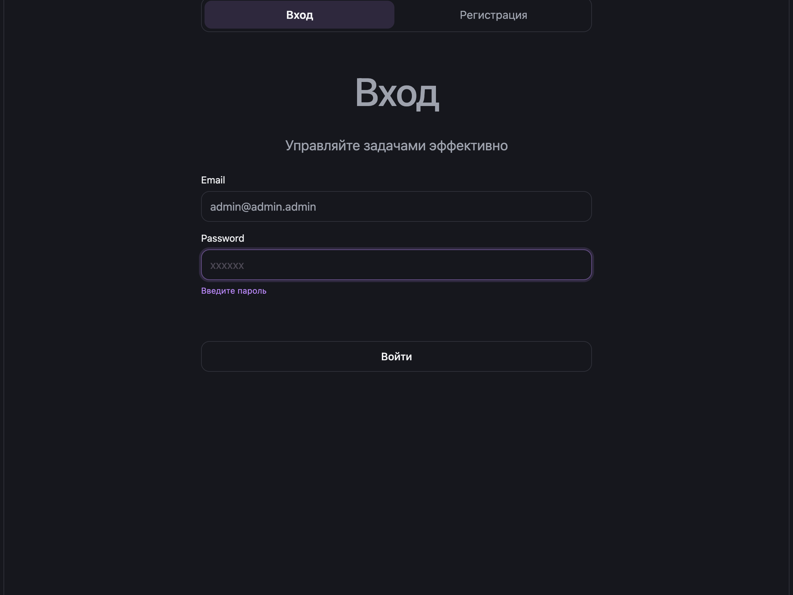
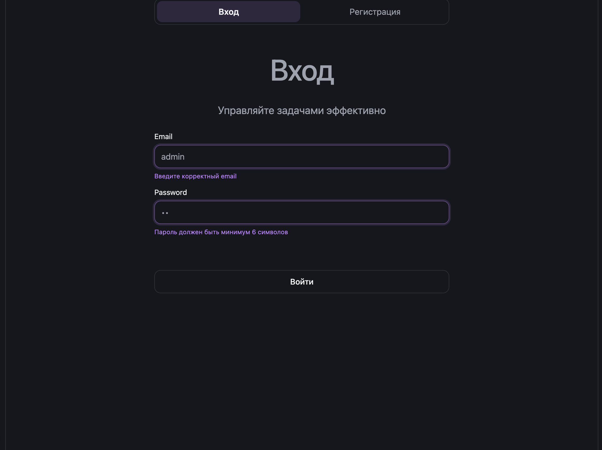
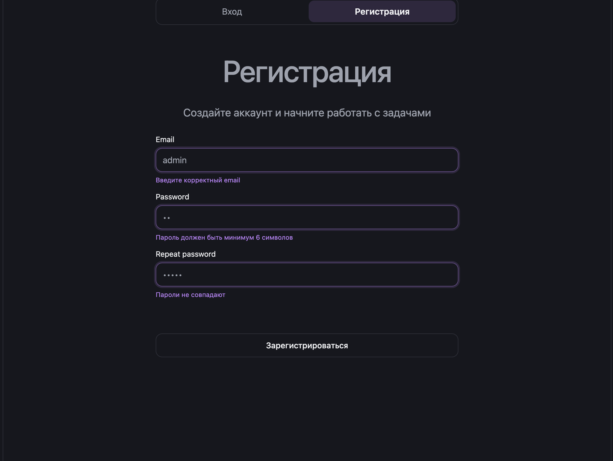
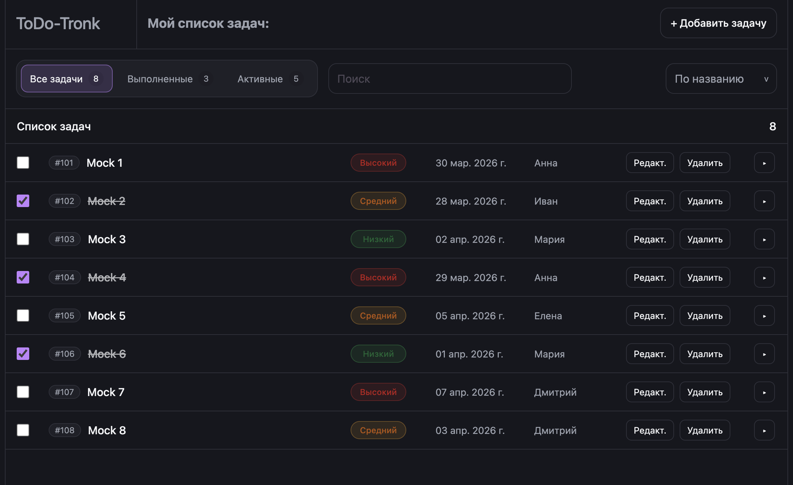
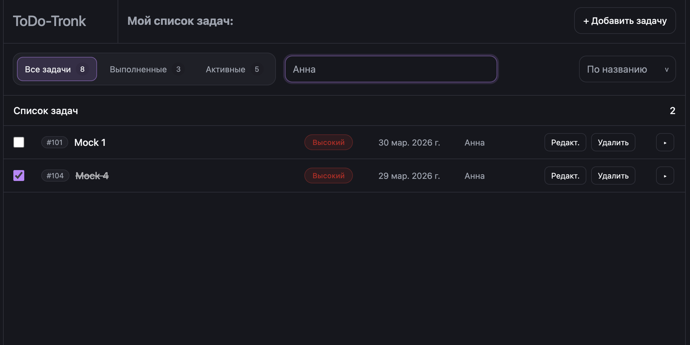
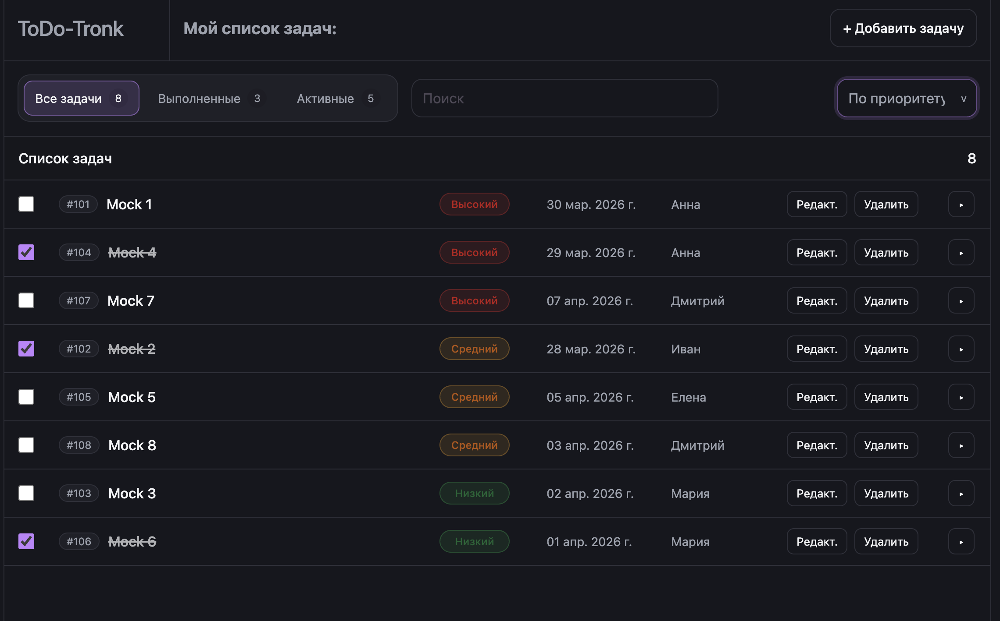
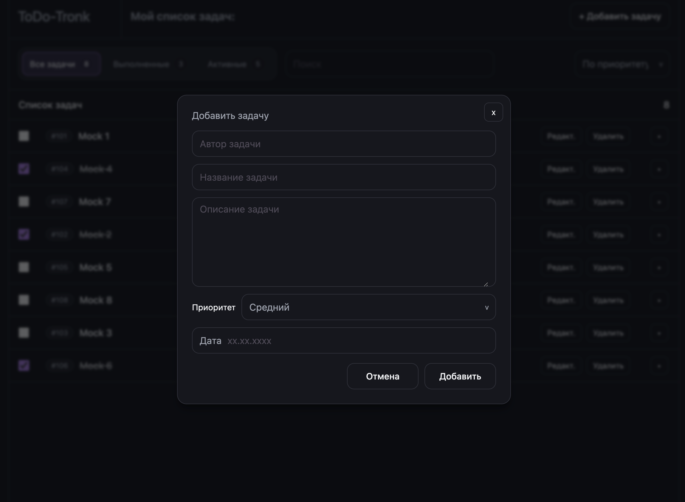
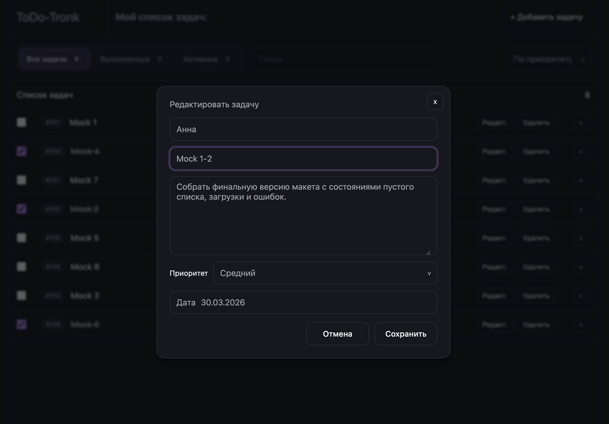

# NuxtToDo-Tronk

Полноценное ToDo-приложение с авторизацией и CRUD-операциями по задачам.

- Frontend: `Nuxt 3` + `Vue 3` + `TypeScript` + `Axios`
- Backend: `Express` + `JWT` + `bcryptjs`
- Хранилище данных: in-memory массивы (без БД, данные сбрасываются после перезапуска сервера)

## Презентация функционала

Страница входа


Валидация полей


Страница регистрации


Основная страница


Поиск


Сортировка (по приоритету)


Добавление задачи


Редактирование задачи


## Что умеет проект

- Регистрация и вход пользователя
- Проверка авторизации по JWT-токену
- Просмотр списка задач
- Создание, редактирование, удаление задач
- Переключение статуса выполнения задачи
- Поиск, фильтрация и сортировка задач на фронтенде

## Структура репозитория

```text
NuxtToDo-Tronk/
  Backend/               # Express API
    controllers/
    middleware/
    routes/
    data/
    server.js
  Frontend/              # Nuxt 3 клиент
    components/
    composables/
    layouts/
    middleware/
    pages/
    plugins/
    nuxt.config.ts
  README.md
```

## Требования

- `Node.js` (рекомендуется актуальная LTS-версия)
- `npm`

## Переменные окружения

### Backend (`Backend/.env`)

```env
PORT=5001
CLIENT_ORIGIN=http://localhost:3000
JWT_SECRET=myjwtkey
```

- `PORT` - порт backend-сервера
- `CLIENT_ORIGIN` - origin frontend-приложения для CORS
- `JWT_SECRET` - секрет подписи JWT

### Frontend (`Frontend/.env`)

```env
NUXT_PUBLIC_API_BASE=http://localhost:5001/api
```

- `NUXT_PUBLIC_API_BASE` - базовый URL API для axios-клиента на фронте

## Установка зависимостей

Устанавливать зависимости нужно отдельно для frontend и backend:

```bash
# 1) Backend
cd Backend
npm install

# 2) Frontend
cd ../Frontend
npm install
```

## Подробный запуск проекта (режим разработки)

Нужны 2 терминала: один для backend, второй для frontend.

### 1. Запуск backend

```bash
cd Backend
npm run dev
```

Сервер стартует на `http://localhost:5001` (если `PORT=5001`).

Проверка:

```bash
curl http://localhost:5001/
```

Ожидаемый ответ:

```text
API is running
```

### 2. Запуск frontend

В новом терминале:

```bash
cd Frontend
npm run dev
```

Frontend будет доступен на:

- `http://localhost:3000` (стандартно для Nuxt)

### 3. Вход в приложение

После открытия `http://localhost:3000`:

- незалогиненный пользователь попадет на `/login`
- после логина будет редирект на `/`
- вход без регистрации осуществляется через: login: admin@admin.admin password: 12121212

## Production-команды

### Frontend

```bash
cd Frontend
npm run build
npm run preview
```

### Backend

В `Backend/package.json` есть только `dev`-скрипт, поэтому прод-запуск:

```bash
cd Backend
node server.js
```

## API документация (все эндпоинты)

Базовый URL backend по умолчанию:

- `http://localhost:5001`

Все API-роуты:

### 1) Healthcheck

#### `GET /`

Проверка, что сервер работает.

Успех `200`:

```text
API is running
```

### 2) Авторизация

#### `POST /api/auth/register`

Регистрация пользователя.

Body:

```json
{
  "email": "user@example.com",
  "password": "123456"
}
```

Успех `201`:

```json
{
  "message": "User created"
}
```

Ошибки:

- `400` - `Email and password are required`
- `400` - `User already exists`

#### `POST /api/auth/login`

Логин и получение JWT.

Body:

```json
{
  "email": "user@example.com",
  "password": "123456"
}
```

Успех `200`:

```json
{
  "token": "jwt_token",
  "user": {
    "id": 1,
    "email": "user@example.com"
  }
}
```

Ошибки:

- `400` - `Email and password are required`
- `400` - `User not found`
- `400` - `Wrong password`

#### `GET /api/auth/me`

Получение текущего пользователя по токену.

Headers:

```http
Authorization: Bearer <token>
```

Успех `200`:

```json
{
  "user": {
    "id": 1,
    "email": "user@example.com"
  }
}
```

Ошибки:

- `401` - `Unauthorized` (нет токена)
- `401` - `Invalid token`
- `404` - `User not found`

### 3) Задачи

Важно: эндпоинты задач сейчас не защищены middleware и доступны без токена.

#### `GET /api/tasks`

Получение массива задач.

Успех `200`:

```json
[
  {
    "id": 101,
    "title": "Mock 1",
    "description": "Описание",
    "dueDate": "2026-03-30",
    "isCompleted": false,
    "createdBy": "Анна",
    "priority": "high"
  }
]
```

Поддерживаемые на фронтенде query-параметры:

- `status` (`all | completed | active`)
- `search` (строка поиска)

Текущее состояние backend-реализации: в контроллере используется `req.params`, поэтому query-параметры фактически не применяются на сервере и фильтрация/поиск выполняются на frontend.

#### `POST /api/tasks`

Создание задачи.

Поддерживаются 2 формата body:

1. Плоский объект задачи
2. Объект с вложенным полем `task`

Пример:

```json
{
  "title": "Новая задача",
  "description": "Описание задачи",
  "dueDate": "2026-04-01",
  "isCompleted": false,
  "createdBy": "Иван",
  "priority": "medium"
}
```

Успех `201`:

```json
{
  "id": 1711730000000,
  "title": "Новая задача",
  "description": "Описание задачи",
  "dueDate": "2026-04-01",
  "isCompleted": false,
  "createdBy": "Иван",
  "priority": "medium"
}
```

Ошибки:

- `400` - `title is required`

#### `PUT /api/tasks/:id`

Обновление задачи по `id`.

Можно передавать частичный объект:

```json
{
  "title": "Обновленный заголовок",
  "isCompleted": true
}
```

Успех `200`: обновленный объект задачи.

Ошибки:

- `400` - `Invalid id`
- `400` - `Nothing to update`
- `404` - `Task not found`

#### `DELETE /api/tasks/:id`

Удаление задачи по `id`.

Успех `200`: удаленный объект задачи.

Ошибки:

- `400` - `Invalid id`
- `404` - `Task not found`

### 4) Дополнительный auth-маршрут

#### `GET /api/me`

Этот эндпоинт дублирует `GET /api/auth/me` и также требует JWT.

Headers:

```http
Authorization: Bearer <token>
```

Успех/ошибки аналогичны `GET /api/auth/me`.

## Как работает авторизация во frontend

- JWT сохраняется в `localStorage` под ключом `token`
- Axios-интерцептор автоматически добавляет `Authorization: Bearer <token>`
- При ответе `401` токен удаляется и выполняется редирект на `/login`
- Middleware `is-auth` не пускает неавторизованного пользователя на защищенные страницы

## Важные особенности текущей реализации

- Данные пользователей и задач хранятся в памяти процесса (`Backend/data/*.js`)
- После перезапуска backend изменения в задачах/пользователях сбрасываются
- Предустановлен пользователь `admin@admin.admin` (пароль: 12121212) (пароль в репозитории хранится в хешированном виде)
